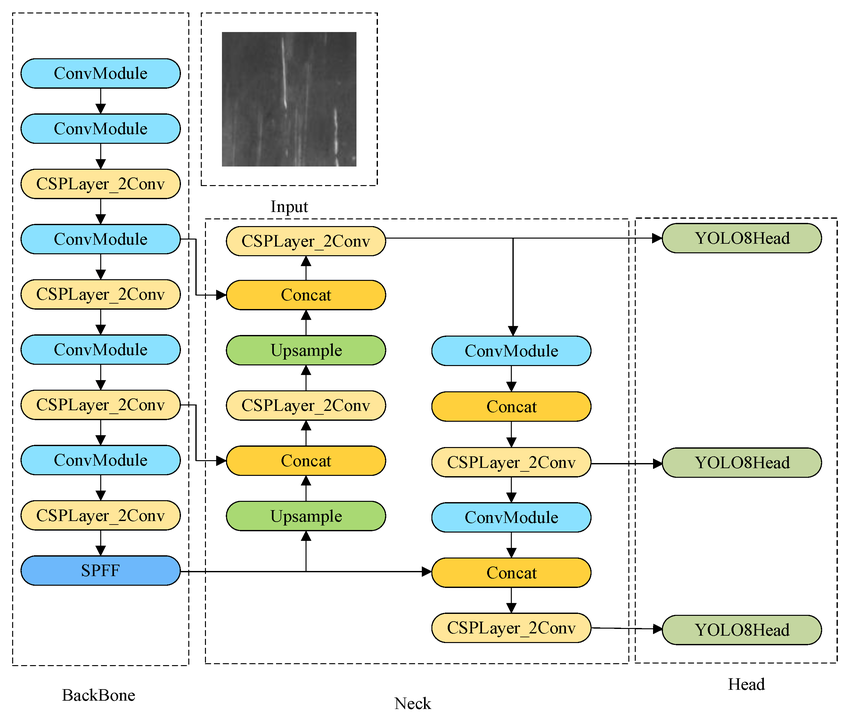

# Infrared Pedestrian Detection 

## Overview

This project focuses on enhancing pedestrian detection in low-visibility conditions by generating synthetic infrared (IR) images from RGB data using a Generative Adversarial Network (GAN). These synthetic images are used to train and validate a YOLO + FPN detection model, allowing for robust perception in 3D traffic simulations.

## Technical Workflow

    1. Dataset Preparation: Resizing and normalizing 10,400 paired RGB-Thermal images.

    2. Synthetic Generation: Training a GAN (Epoch 22 selected as optimal) to translate RGB features into thermal  heat signatures.

    3. Perception: Using YOLO to detect pedestrians in generated thermal frames, specifically handling overlapping subjects.

    4. Integration: Visualizing detections within a simulated traffic environment.

## Results

The final model generates IR images where pedestrians are clearly distinguishable from the background, even when overlapping. This allows for more reliable pedestrian detection in simulated traffic scenarios.